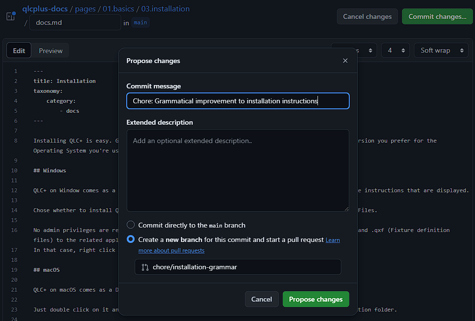

# QLC+ Official Documentation
  
 

Welcome to the official documentation repository for [qlcplus](https://qlcplus.org/)!

The [docs.qlcplus.org](https://docs.qlcplus.org/) website uses the [Grav](https://getgrav.org/) content management system (CMS) and Learn2 with Git Sync plugin. This helps us to collaboratively edit our Markdown-based documentation. When changes are made to this repo the website automatically reflects the changes.

## Contributing

If you find a problem but don't have the time to fix it, you can [open an issue](https://github.com/mcallegari/qlcplus-docs/issues) to let us know about it. Otherwise expand the below instructions to edit a page right here in GitHub:

Edit a page directly

1. Click the  link on the page of documentation you wish to improve. You'll be redirected to a preview in the GitHub editor. 
2. Click the pencil icon (Edit this file) on the top right of the preview. 
3. Edit the page
4. Click Commit Changes...
5. Give a quick summary of your proposed improvement through the commit message. The bellow is an example:

6. Your changes will be reviewed and merged if they meet our guidelines.

## Support QLC+
If QLC+ helps you to make your lights shine, please consider donating or buying merch. Use these links to find out more:
<table>
<tr>
<td style="text-align:right">Sponsor the QLC+ project:</td>
<td style="text-align:left"></td>
</tr>
<tr>
<td style="text-align:right">Donate via PayPal:</td>
<td style="text-align:left"></td>
</tr>
<tr>
<td style="text-align:right">Buy merch, themes and plugins:</td>
<td style="text-align:left"></td>
</tr>
</tbody>
</table>

## Join the Discussion
Engage with the QLC+ community in the [forums](https://www.qlcplus.org/forum/) or on social media to share your knowledge, ask questions, and collaborate with other users.

By contributing to the documentation, you're not only helping yourself but also supporting the QLC+ community. Together, we can create a comprehensive and reliable resource for lighting enthusiasts using QLC+.

    
    

